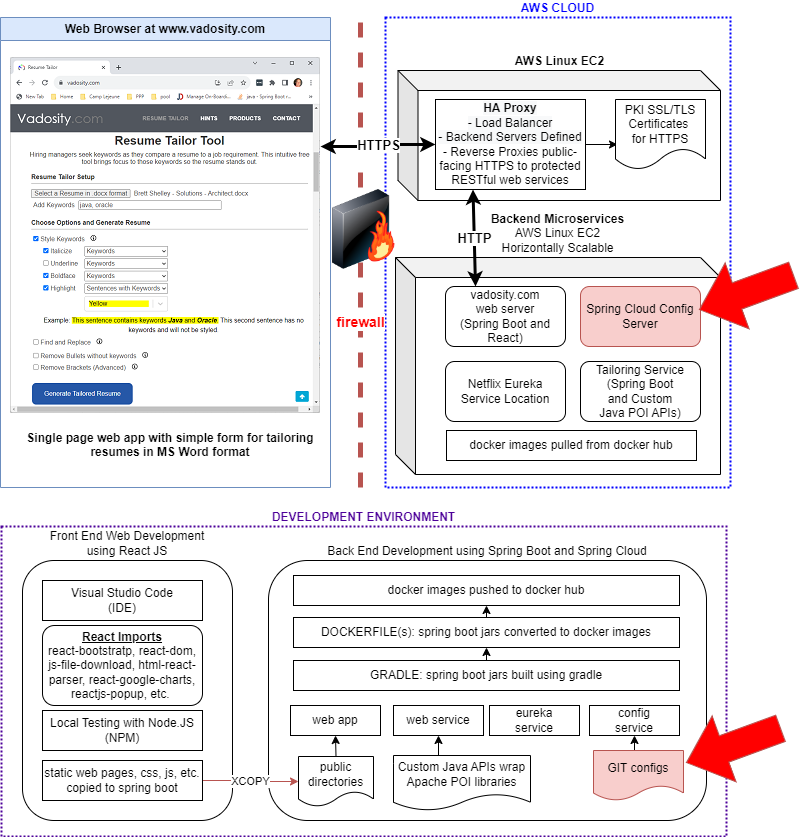

# Spring Configuration Properties stored in Git

The red arrows indicate how this project's build artifacts fit into the Resume-Tailor application architecture

</img>

# config-server-git

The properties needed by the config-service to start the spring config server and deliver properties using the spring cloud approach
